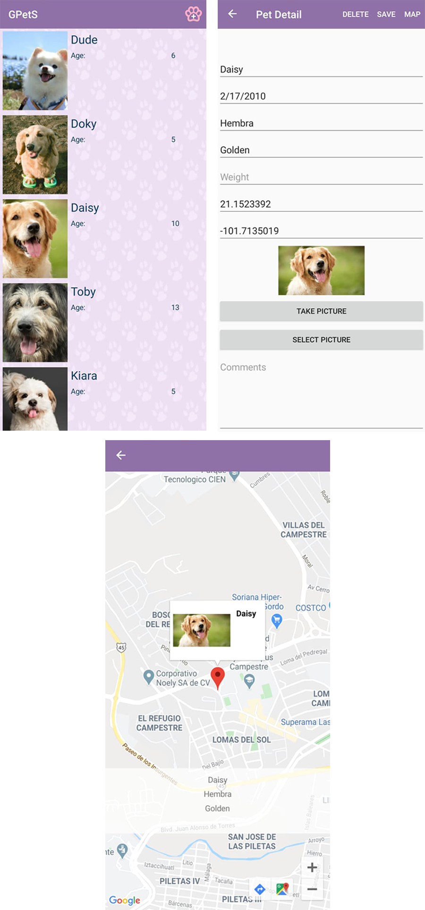

# GPetS

## Preview

## Requirements
* To use the map, it is necessary to create a [Google Cloud Platform](https://console.cloud.google.com/getting-started) account and enable an API KEY from Maps SDK for Android, after that it must be placed in the android manifest file.
